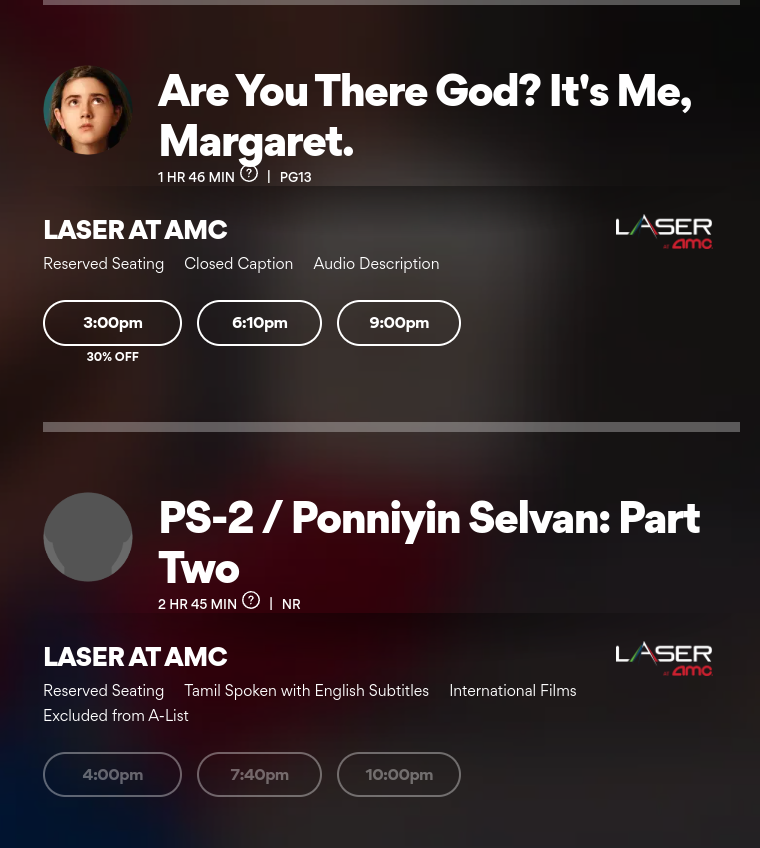

# About

This is a simple Chrome extension for filtering out non "A-List" events (ie free) from the showings page.

# Installation

1. Go to the main Chrome Extensions page: chrome://extensions/

2. Click "Load unpacked":

3. Point to the directory where you cloned this repository.

# Usage/Features

When you're on the general showtimes page, this extension will simply mark the "Excluded from A-List" events as disabled (look at the bottom showing).

# Roadmap

- [ ] Fix issue with Chrome's runtime errors? See [here](https://github.com/raleighlittles/Chrome-AMC-AList-Filter/issues/1)

- [ ] Figure out why Chrome is saying the page is loaded when it's not actually finished loading yet. See [here](https://github.com/raleighlittles/Chrome-AMC-AList-Filter/issues/2)